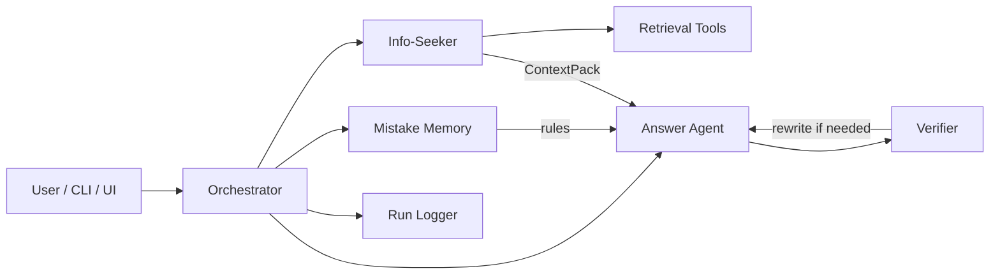
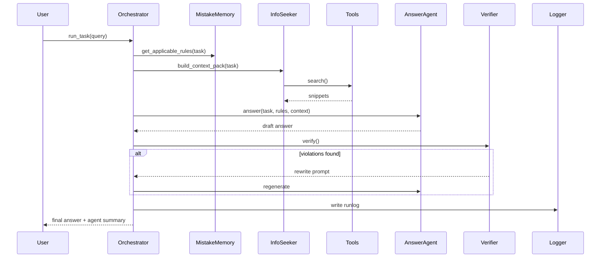
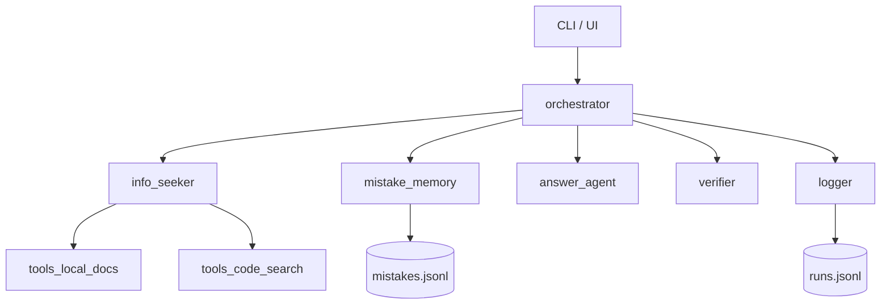

# Anti-Lazy / Anti-Amnesia Orchestrator — Hackathon Roadmap

## Goal

Build a deterministic multi-agent wrapper around an LLM that:

1) Forces retrieval before answering (anti-laziness)  
2) Learns from corrections and changes future behavior (anti-amnesia)  
3) Logs every step so judges can inspect what happened  
4) Demonstrates improvement across runs  

This is not about training a model.  
It is about enforcing behavior through orchestration, retrieval, rules, and verification.

---

## Core Principles

- Fixed pipeline
- Retrieval is mandatory
- Mistakes become reusable rules
- Rules are scoped (domain + intent)
- Grounding is enforced
- Everything is logged
- One killer before/after demo

---

## Architecture Overview

## Deterministic Pipeline

Every run:

## Deliverables by End of Hackathon
### Must-Have

<li>Orchestrator with fixed state machine

<li>Info-Seeker with mandatory retrieval

<li>ContextPack abstraction

<li>Answer Agent that must cite snippets

<li>Mistake-Memory with scoped rules

<li>One rewrite-on-failure verifier

<li>JSONL logging

<li>CLI or minimal web UI

<li>One scripted demo scenario

### Nice-to-Have

<li>Code search tool

<li>Metrics table

<li>Minimal web viewer

<li>Embedding similarity

<li>Visualization of mistake statistics

## Modules

# Phase Plan (1.5 Days)
## Phase 0 — Repo + Skeleton (1–2h)

<li>Create module layout

<li>Add data directory

<li>Stub LLM client

<li>Define schemas

<li>Create empty docs corpus

### Exit criteria:
    run_task("hello") executes full pipeline and logs JSON.

## Phase 1 — Orchestrator + Info-Seeker (3–4h)

<li>Deterministic classification

<li>Required tool checklist

<li>Local docs search

<li>Tool coverage logging

### Exit criteria:
    CLI prints task type, tools called, snippet count.

## Phase 2 — Answer Agent + Grounding Enforcement (3–4h)

<li>Prompt builder with rules + snippets

<li>Structured JSON output

<li>Require used_snippet_ids

<li>Clarifying questions when no context

### Exit criteria:
    Answers include snippet IDs or say no context found.

## Phase 3 — Mistake Memory (3–4h)

<li>Feedback CLI command

<li>JSONL storage

<li>Scoped retrieval

<li>Severity levels

<li>Conflict suppression

### Exit criteria:
    Second run shows rule applied.

## Phase 4 — Verifier + Rewrite Loop (2–3h)

<li>Detect snippet misuse

<li>One rewrite pass

<li>Log both attempts

### Exit criteria:
    Auto-correct triggers when grounding fails.

## Phase 5 — Demo Scenario + Polish (2–3h)

<li>Script first-fail/second-pass

<li>README pitch

<li>Screenshots / terminal capture

### Exit criteria:
    5-minute demo with visible improvement.

## Metrics to Surface
### Anti-Lazy

<li>required_tools

<li>tools_called

<li>tool_coverage

<li>snippets_count

<li>used_snippet_ids count

### Anti-Amnesia

<li>rules_applied

<li>times_triggered

<li>post_fix_success

## Demo Script

1. Ask an API question

2. Model ignores docs

3. Show run log

4. Add correction rule

5. Re-run

6. Show rule applied + snippet usage

## What We Explicitly Cut

<li>Universal domain claims

<li>Model training

<li>Fancy dashboards

<li>Embeddings unless time allows

---

# Pitch Line

    Instead of hoping models behave better, we wrap them in an orchestrator that forces retrieval and permanently patches mistakes with scoped business rules.

# Stretch Goal: Deepnative Alignment

Mistake rules written as reusable business logic:

<li>When summarizing tickets, group by theme.

<li>When generating actions, assign owner + due date.

<li>When answering APIs, always cite docs.

<li>Over time this becomes a Business Logic Memory Layer.
